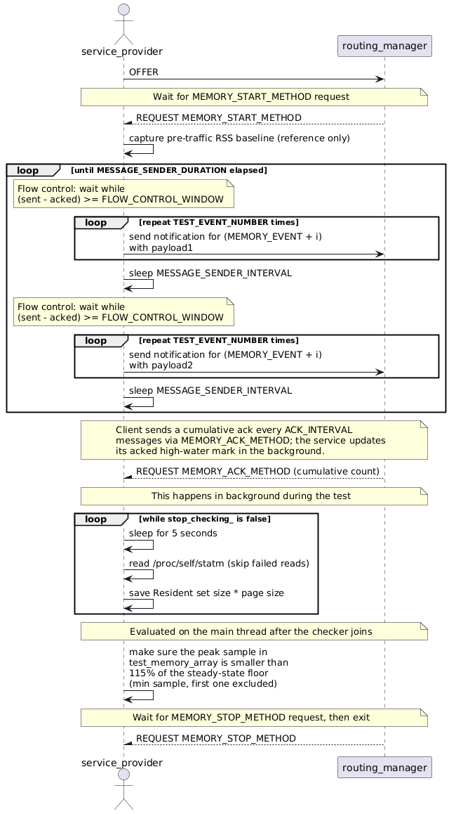
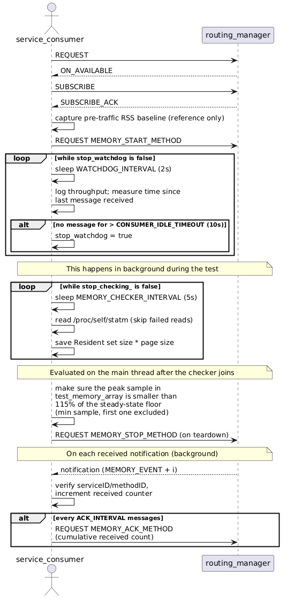

# Memory Test

This test makes sure that memory load does not increase significantly during vsomeip-lib operation. It has one service-provider offering a service and sending notifications for various methods with different payloads and a service-consumer subscribing to the offered service.

## Purpose

- Assure that memory load usages does not increase significantly

## Test Logic

The producer streams large (SOME/IP-TP segmented) notifications while both sides sample their resident set size (RSS). Because the notifications are unreliable (UDP) there is no transport backpressure, so the sender uses **application-level flow control** to stay in step with the consumer: it never lets more than `FLOW_CONTROL_WINDOW` notifications be outstanding (sent but not yet acknowledged). This keeps the endpoint send queue from filling on a slow, Valgrind-instrumented or otherwise contended host, so the RSS stays flat and any growth beyond the threshold reflects a genuine leak rather than transient queue congestion.

The sender runs for a fixed wall-clock duration (`MESSAGE_SENDER_DURATION`) rather than a fixed message count, so the amount of data scales to whatever the consumer can absorb while the test duration stays bounded well under its timeout in every environment.

### Evaluation

Both sides evaluate their samples the same way, **on the main thread** once sampling has stopped (so a failure is reported by gtest instead of escaping a worker thread and aborting the process). The check compares the *peak* sampled RSS against the **steady-state floor** — the lowest RSS sampled once traffic is flowing — and requires the peak to stay below `MEMORY_LOAD_LIMIT` (115%) of that floor. The floor is the minimum over the collected samples, excluding the very first sample (which can be taken mid warm-up ramp) and any failed `/proc` read (which reads as `0` and is discarded). Comparing against the floor rather than the cold pre-traffic baseline tolerates the one-time working-set growth when traffic starts, while a genuine leak still climbs above the floor and fails the test. Each side also captures a pre-traffic RSS baseline, but this is logged for reference only and is **not** part of the assertion.

### Service provider

The service provider offers the service, then waits for the `MEMORY_START_METHOD` request. On receiving it, it captures a pre-traffic RSS baseline (reference only), starts the background memory sampler (RSS every 5 s), and begins sending two notifications with two different payloads for all event IDs, throttled by the flow-control window. When `MESSAGE_SENDER_DURATION` elapses it stops sampling and, on the main thread, evaluates the samples against the steady-state floor as described above. Finally it waits for the `MEMORY_STOP_METHOD` request before exiting, so the stop handshake is the last step.



### Service consumer

The service consumer requests and subscribes to the offered service, then sends the `MEMORY_START_METHOD` request (capturing its own pre-traffic RSS baseline first, for reference only). Like the provider it samples RSS in the background for the whole test. For every `ACK_INTERVAL` notifications received it sends the provider a lightweight `MEMORY_ACK_METHOD` request carrying its cumulative received count — this is the flow-control signal, and being cumulative it is robust to the occasional dropped UDP ack. A watchdog logs throughput every `WATCHDOG_INTERVAL` (2 s) and, once no message has arrived for `CONSUMER_IDLE_TIMEOUT` (10 s), concludes the test and evaluates its samples against the steady-state floor the same way as the provider. It sends `MEMORY_STOP_METHOD` last, on teardown, once the evaluation is done.



## Flamegraph Profiling (CPU Performance Analysis)

### Overview

This test supports optional CPU flamegraph profiling via Linux `perf`. Flamegraphs visualize where the CPU time is spent during test execution, making it easy to identify performance hotspots and bottlenecks.

### Enabling Flamegraph Profiling

Flamegraph profiling is **automatically enabled** when `VALGRIND_TYPE` is empty. It is **disabled** when any valgrind profiler is active (memcheck, massif, etc.).

#### Via CMake (build-time configuration)

```bash
# Build without valgrind/sanitizers (perf profiling will be enabled automatically)
cmake -DCMAKE_BUILD_TYPE=RelWithDebInfo ...
ctest --preset ci-network-tests
```

#### Via Docker Compose (runtime configuration)

```bash
# Leave VALGRIND_TYPE and SANITIZER_TYPE empty to enable perf profiling
export VALGRIND_TYPE=''
docker compose --project-directory zuul/network-tests up
```

### What Happens When VALGRIND_TYPE is Empty

1. **Service and client processes** are launched under `perf record` at 99 Hz sampling frequency with call-graph recording (`-g`)
2. **Valgrind is automatically skipped** (perf and valgrind cannot run together)
3. **After tests finish**, flamegraph SVG files are automatically generated from the recorded perf data
4. **Output files** are placed in the test binary directory:
   - `memory_test_service_flamegraph.svg` — interactive flamegraph for the service
   - `memory_test_client_flamegraph.svg` — interactive flamegraph for the client
   - `memory_test_service_firefox_profiler.perf` — Firefox Profiler compatible file
   - `memory_test_client_firefox_profiler.perf` — Firefox Profiler compatible file
